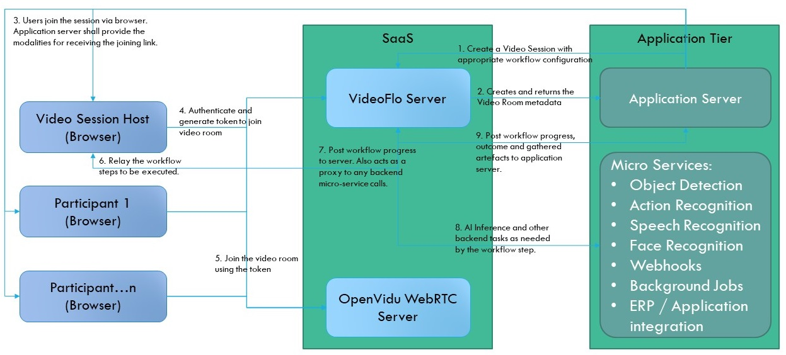

# What is Videoflo
An on-premise WebRTC based SaaS API to build video-based workflows such as Video KYC, Customer Onboarding, etc. Currently Videoflo is being built with exclusive focus on enabling video-based & agent controlled Video KYC applications.

However, Videoflo in the future is envisioned to support the following types of video interactions:
- P2P Video workflows – allowing two participants to connect via video connection over WebRTC and perform workflows such as remote verification of BC locations. This mode will not require a WebRTC server and will provide very limited recording capabilities.
- Autonomous workflows – similar to DSC wherein the user is guided through a few steps by a bot.
- Multi-party workflows such as a classroom, where a teacher is presenting to multiple students, but also broadcasting questions / receiving feedback in real time to all the participants.

# Data Flow


# Steps to Integrate Videoflo into your application
Videoflo is primarily a video conferencing based workflow application. Therefore, before we get into the technical details of the integration, let us first introduce you to some of terminologies you will see throughout our docs.

The following key actors and subjects are required before you can start using it in your application.
1. **Session**: All workflows execute within a video conference session. Therefore, executing a workflow requires a session to be created.
2. **Participants**: Each session requires two or more participants. Videoflo does not require creation of user accounts for each session. However, each *participant* must be assigned an *externalParticipantId* that uniquely identifies the participant within that session.
3. **Activities**: A workflow consists of multiple steps to be executed. In Videoflo such steps are called *Activities*. Videoflo comes with a built-in set of activities. In future, APIs will be provided for integration partners to build their own activities as well. However, current support is limited to built-in activities only.
4. **Webhooks**: Videoflo needs a way to send events and data back to your application. Webhooks are used for this purpose.

Now that you are familiarized with the terminology, let us dig into the integration. Integration happens at two levels:
1. **Backend**: Your application's server, should be primarily responsible for invoking Videoflo ReST APIs to create sessions, generate tokens on behalf users, retrieve data and call recordings etc.
2. **frontend**: As of now, Videoflo only supports browser based applications. We intend to support mobile and desktop applications as well in the future. Currently there are two SDKs available:
   1. **[Videoflo Angular Library](docs/angular-library.md)**
   2. **[Videoflo Web Component](docs/web-component.md)**


You can use the [editor on GitHub](https://github.com/botaiml/videoflo-sdk/edit/main/README.md) to maintain and preview the content for your website in Markdown files.

Whenever you commit to this repository, GitHub Pages will run [Jekyll](https://jekyllrb.com/) to rebuild the pages in your site, from the content in your Markdown files.

### Markdown

Markdown is a lightweight and easy-to-use syntax for styling your writing. It includes conventions for

```markdown
Syntax highlighted code block

# Header 1
## Header 2
### Header 3

- Bulleted
- List

1. Numbered
2. List

**Bold** and _Italic_ and `Code` text

[Link](url) and 
```

For more details see [GitHub Flavored Markdown](https://guides.github.com/features/mastering-markdown/).

### Jekyll Themes

Your Pages site will use the layout and styles from the Jekyll theme you have selected in your [repository settings](https://github.com/botaiml/videoflo-sdk/settings/pages). The name of this theme is saved in the Jekyll `_config.yml` configuration file.

### Support or Contact

Having trouble with Pages? Check out our [documentation](https://docs.github.com/categories/github-pages-basics/) or [contact support](https://support.github.com/contact) and we’ll help you sort it out.
